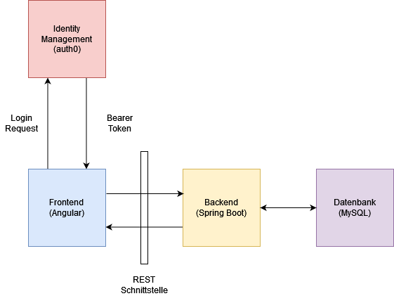
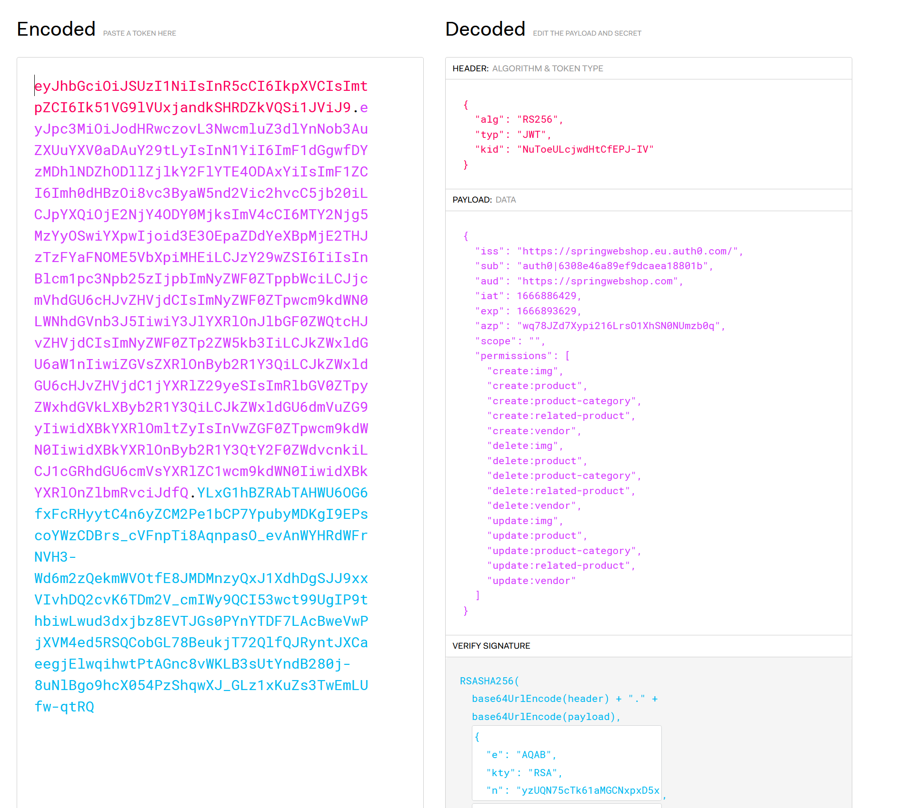
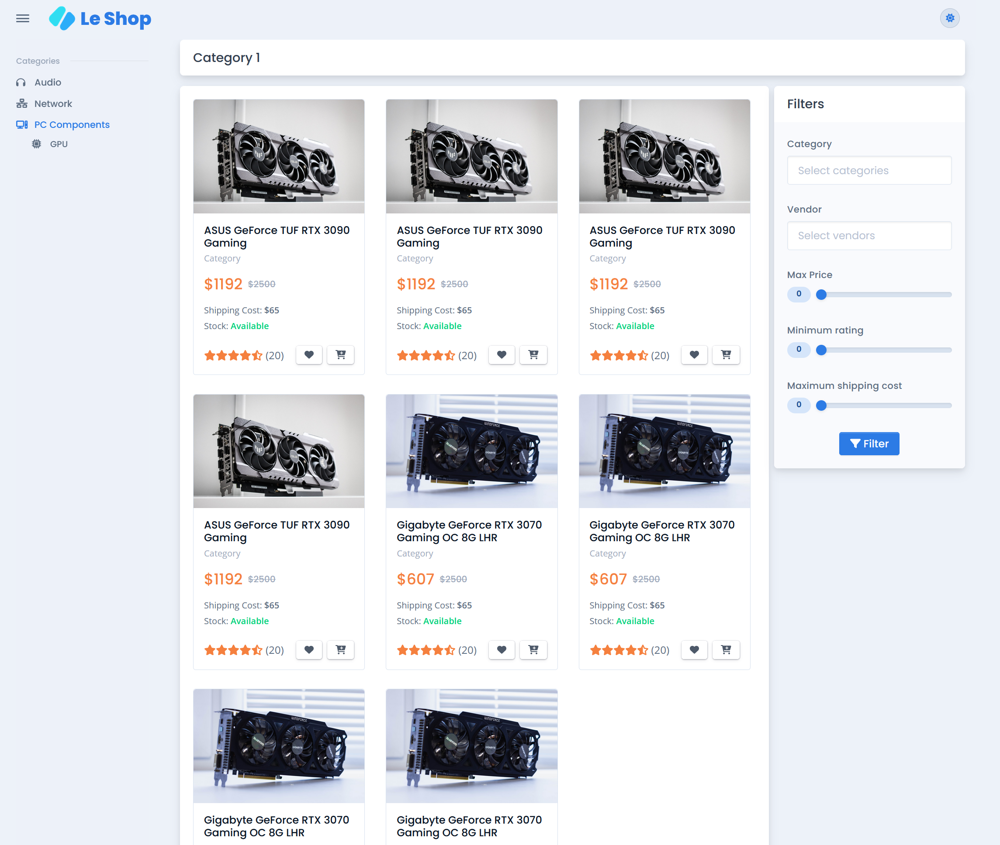

<br />
<div style="text-align: center">
    
    <h1 style="margin-top: 0">Spring Technik</h1>
    <p>
        Ein Technologiewebshop für das Java Enterprise Edition Modul
    </p>
    <a href="https://git.ffhs.ch/jorge.paravicini/jee_webshop"><strong>Zum Backend</strong></a>
    <br />
    <a href="https://git.ffhs.ch/jorge.paravicini/jee_webshop_frontend"><strong>Zum Frontend</strong></a>
</div>

---

# Inhalt

<!-- TOC -->
* [Inhalt](#inhalt)
* [Einführung](#einführung)
* [Anforderungen](#anforderungen)
  * [Funktionale Anforderungen](#funktionale-anforderungen)
  * [Nicht-funktionale Anforderungen](#nicht-funktionale-anforderungen)
* [Architektur](#architektur)
  * [Verwendete Technologien](#verwendete-technologien)
  * [Übersicht](#übersicht)
  * [MVC](#mvc)
  * [Klassendiagramm](#klassendiagramm)
  * [Entities](#entities)
* [Installation](#installation)
  * [Backend](#backend)
  * [Frontend](#frontend)
* [Statusberichte](#statusberichte)
  * [Statusbericht 28.09.2022](#statusbericht-28092022)
  * [Statusbericht 26.10.2922](#statusbericht-26102922)
<!-- TOC -->

---

# Einführung

Für das Module Java Enterprise Edition wird ein Online-Shop mit Front- und Backend erstellt. 
In dem selbst-entwickelten Shop kann man Elektronikteile kaufen. Von Audio Geräten, zu Netzwerkteile bis zu
jeglichen PC-Komponenten die man benötigt, um einen eigenen PC zu bauen.

Das Projekt ist in zwei geteilt. Das Backend ist zuständig, eine einfach bedienbare jedoch sichere Schnittstelle
anzubieten. Das Frontend kommuniziert mit dieser Schnittstelle und bietet eine Grafische Oberfläche für die Benutzer.

# Anforderungen

In diesem Abschnitt werden die funktionalen und nicht-funktionalen Anforderungen für das Endprodukt 
des Webshops spezifiziert. 

## Funktionale Anforderungen

Folgende Anforderungen muss der Shop unterstützen:

| Titel                                         | Beschreibung                                                                                                                                                  |
|-----------------------------------------------|---------------------------------------------------------------------------------------------------------------------------------------------------------------|
| User Registrierung                            | Ein Benutzer muss sich auf der Seite einen neuen Account erstellen können.                                                                                    |
| Anmelden                                      | Ein Benutzer der noch nicht angemeldet ist und schon einen Account hat, muss sich mit diesem Account anmelden können.                                         |
| Abmelden                                      | Ein Benutzer der schon angemeldet ist, muss sich abmelden können.                                                                                             |
| Sortiment Übersicht                           | Auf der Startseite des Shops sollen Produkte vorgeschlagen werden, welche täglich (oder in einem anderen Zeitraum) neu generiert werden.                      |
| Kategorien                                    | Die unterschiedlichen Kategorien von Produkten müssen dargestellt und auswählbar sein.                                                                        |
| Kategorie Übersicht                           | Wenn eine Kategorie ausgewählt wird, müssen die Produkte dieser Kategorie in einer Übersicht angezeigt werden.                                                |
| Produktdetails                                | Wenn ein Produkt ausgewählt wird, müssen die Details dieses Produktes angezeigt werden.                                                                       |
| Neue Produkte in persönlichen Einkaufswagen   | Angemeldete Benutzer müssen Produkte in ihren persönlichen Einkaufswagen aufnehmen können.                                                                    |
| Einkaufswagen ansehen                         | Angemeldete Benutzer müssen ihren persönlichen Einkaufswagen ansehen können.                                                                                  |
| Anzahl Produkte im Einkaufswagen modifizieren | Im Einkaufswagen soll die Anzahl der Produkte geändert werden können.                                                                                         |
| Produkt aus Einkaufswagen löschen             | Produkte müssen aus dem persönlichen Einkaufswagen gelöscht werden können.                                                                                    |
| Produkt der Wunschliste hinzufügen            | Angemeldete Benutzer müssen Produkte zu ihrer persönlicher Wunschliste hinzufügen können.                                                                     |
| Wunschliste ansehen                           | Angemeldete Benutzer müssen ihre Wunschliste ansehen können.                                                                                                  |
| Produkt aus Wunschliste entfernen             | Angemeldete Benutzer müssen Produkte aus ihrer Wunschliste löschen können.                                                                                    |
| Review erstellen                              | Angemeldete Benutzer sollen Reviews erstellen können für Produkte.                                                                                            |
| Reviews von anderen sehen                     | Angemeldete Benutzer müssen die Reviews von anderen sehen können.                                                                                             |
| Durchschnitt Bewertung der Produkte sehen     | Die Durchschnittsbewertung soll für jedes Produkt angezeigt werden. Falls noch keine Bewertungen existieren soll stehen, dass es noch keine Bewertungen gibt. |
| Checkout                                      | Ein angemeldeter Benutzer muss den Inhalt seines Warenkorbes bestellen können.                                                                                |
| Adresse speichern                             | Um die Bestellung in der Zukunft einfacher zu machen, soll die Lieferadresse persistiert werden.                                                              |
| Rabatte anzeigen                              | Falls ein Produkt ein Rabatt hat, muss dieser angezeigt werden.                                                                                               |
| Admin oberfläche                              | Admins müssen über eine Weboberfläche Produkte bearbeiten können.                                                                                             |
| Beschützte Endpoints                          | Persönliche und Adminendpoints (z.B. neues Produkt erstellen) müssen beschützt werden, somit nur befugte Personen diese ausführen können.                     |

## Nicht-funktionale Anforderungen

| Titel             | Beschreibung                                           |
|-------------------|--------------------------------------------------------|
| Datenbank         | Für die Datenbank soll MySQL verwendet werden.         |
| Frontend          | Für das Frontend soll Angular verwendet werden.        |
| Backend           | Für das Backend soll Spring Boot verwendet werden.     |
| Authentifizierung | Für die Authentifizierung soll Auth0 verwendet werden. |


# Architektur

## Verwendete Technologien

Die Bedingung an das Projekt ist, dass das Backend mit JEE oder einem ähnlichen
Produkt entwickelt wird. Als Alternative für Jakarta wird Spring Boot verwendet.

Unten aufgelistet ist genau definiert, welche Technologien verwendet werden.

* Frontend  
  * Typescript
  * Angular
  * Fontawesome
  * Bootstrap
  * Falcon
  * Auth0
  * Rxjs
  * Lottie
  * Choices.js
* Backend
  * Kotlin
  * Spring Boot
  * Springdoc
  * Liquibase
  * Mockk
  * JUnit
  * Auth0
* Datenbank
  * MYSql

## Übersicht



Das Frontend, welches in Angular entwickelt wird, kommuniziert mit dem Backend anhand einer REST-API.
Das Backend kommuniziert mit einer MySQL Datenbank, um die Requests der Benutzer zu bearbeiten.

Eine Anforderung ist, dass nur Admins neue Produkte erstellen können.
Eine weitere ist, dass Benutzer Rezensionen schreiben und editieren können.
Damit diese Anforderungen erfüllt werden können, braucht es ein Identity Management.
In diesem Fall wird auth0 als provider verwendet.
Das Frontend kann dem Backend ein Bearer Token in dem `Authorization` Header mitgeben, um beschützte Endpoints auszuführen.

Falls das Backend eine Anfrage erhält für einen beschützten Endpoint ohne `Authorization` Header, 
dann wird ein `401 Unauthorized` Fehler zurückgegeben. Falls ein `Authorization` Header mitgegeben wurde, 
jedoch dieser Falsch ist, oder nicht genügend Rechte hat, um diesen Endpoint auszuführen, 
dann wird ein `403 Forbidden` Fehler zurückgegeben.

## MVC


Das Backend wird mit der MVC Architektur aufgebaut. Ein Benutzer sendet eine Request an das Backend an einen Controller
und gibt dabei ein optionales Input DTO (Data Transfer Object) mit. Der Controller ist dafür verantwortlich
diese Request zu verarbeiten. Er sendet sie weiter an ein bestimmtes Service. Dieser Service verbindet 
sich mit einem oder mehreren Repositories um die Entities anzupassen im Falle einer POST, PUT oder DELETE Request,
oder Werte von den Entities zu holen im Falle einer GET Request.

Nachdem das Service fertig ist, sendet es ein Output DTO zurück an den Controller. Der Controller wandelt
das DTO in ein JSON um, welches verwendet wird um die Verbindung zwischen Front- und Backend sicherzustellen.

## Klassendiagramm


In diesem Klassendiagramm sieht man die Endpoints welche die Controller besitzen werden. Jede Methode 
von einem Controller wird ein Endpoint sein. Jeder Controller hat einen zuständigen Service (im Bild gekennzeichnet mit dem gleichen Namen).

Die Services sind folgendermassen aufgebaut. Jeder Service erbt die CRUD Methoden des Baseservice (IService).
Der Service muss die methoden des Interfaces implementieren. Ein Service hat Zugriff auf einen oder mehrere
Repositories. In diesen Repositories wird der Zugriff auf die Entities der Datenbank gewährleistet.

Über den Controller, Service, Repositories und Entities gibt es den Global Exception Handler. 
Dieser ist verantwortlich, alle Exceptions zu fangen und wandelt diese in einen äquivalenten Status Code. 
Das heisst, falls eine Exception `NotFoundException` in einem Service geworfen wird, dann fängt der Exception Handler
diesen Fehler und gibt dem Benutzer eine Antwort mit dem Status Code `404 Not Found`. Dies wurde für alle 
bekannten Fehlermeldungen gemacht, und vereinfacht die Logik in den Controller um einiges.


## Entities


In diesem Diagramm sieht man, wie die Datenbank aufgebaut wird. Nicht zu sehen sind alle Tabellen die mit
den Benutzern zu tun haben. Diese werden extern in einer zweiten Datenbank gespeichert, die von `auth0` 
verwaltet wird.


# Installation

## Backend

db 3306
swagger 8080
Um das Backend zu installieren müssen folgende Kommandos ausgeführt werden:

```shell
git clone https://git.ffhs.ch/jorge.paravicini/jee_webshop
cd jee_webshop
docker compose -f docker-compose.yml up
```

Dieses Kommando startet das Backend welches auf Port `8080` läuft, und dessen Datenbank welches auf Port `3306` läuft.
Swagger kann auf folgendem Link geöffnet werden: http://localhost:8080/swagger-ui/index.html

## Frontend

Um das Frontend zu installieren wird [Node16](https://nodejs.org/download/release/v16.19.0/) benötigt. 
> **_WICHTIG:_** Node18, die letzte Version von Node wird noch nicht unterstützt. 

```shell
git clone https://git.ffhs.ch/jorge.paravicini/jee_webshop_frontend
cd jee_webshop_frontend

npm install -g yarn
yarn install

ng serve
```

Das Frontend läuft auf Port `4200` und kann auf folgender Adresse geöffnet werden: http://localhost:4200


# Statusberichte

## Statusbericht 28.09.2022

In dem ersten Arbeitsschritt wurde klar definiert, was die Endapplikation unterstützen muss und welche Technologien 
verwendet werden sollen. Zusätzlich wurden drei Projekte erstellt. 
Das erste Projekt ist das Frontend, welches in Angular geschrieben wird. Da ich Angular schon etwas kenne, kann ich
mich auf das Entwickeln einer guten Architektur und auf das Backend fokussieren. 
Das zweite Projekt ist das Spring Boot Backend. Spring wurde über Jakarta ausgewählt, da in meiner Erfahrung 
Spring beliebter ist und daher bessere Dokumentationen gefunden werden können.
Schlussendlich wurde noch ein Projekt in Auth0 erstellt, welches das User-Management übernehmen wird. 
Zusätzlich zu den Projekten wurde für das Front- und Backend ein GitLab Repository erstellt welche im Header dieses
Dokumentes verlinkt sind.

Um die Dokumentation zu vereinfachen, wurde im Backend Swagger installiert. Dies ermöglicht die Endpoints im Code
zu dokumentieren und im Browser danach anzusehen. Hier ist ein Beispiel wie die Dokumentation für das Backend aussehen wird.


Als Nächstes wurde eine Architektur für das Backend entworfen, welche noch verfeinert werden muss und im nächsten
Statusbericht hinzugefügt wird. Aber in Kürze, die Architektur wird dem MVC (Model-View-Controller) Architektur pattern 
folgen. Es wird ein Model geben, welche die Entities der Datenbank repräsentieren, eine View, welche die Schnittstelle
zu den Endnutzern darstellen. Schlussendlich gibt es noch die Controller, welche die Anfragen der Benutzer empfange, 
sie verarbeiten, und die verarbeiteten Models wieder zurückgibt. 

Schlussendlich wurde das Backend initialisiert, sodass Kotlin unterstützt wird und alle benötigten Abhängigkeiten
installiert sind. In diesem Zustand ist das Backend bereit entwickelt zu werden, sobald die genauen Schnittstellen 
entworfen sind.

Als Seitennote warum MySql verwendet wird anstatt PostgreSQL. Es wurden schon ein par kleine Controllers entwickelt, um
sicherzustellen, dass die Architektur funktioniert. Dabei wurde observiert, dass wenn man die Datenbank seeded, also
vordefinierte Daten in die Datenbank ladet, dann wird der interne ID-Counter von PostgreSQL nicht erhöht. Das bedeutet,
dass wenn man 5 Einträge vordefiniert, und danach einen neuen Eintrag in dieselbe Tabelle einfügen möchte, dann gibt 
es einen ID-Konflikt. Dieser Fehler existiert in MySQL nicht, da der ID-Counter auch erhöht wird, wenn man Einträge mit
expliziten IDs hinzufügt.

Die nächsten Schritte werden sein:
* Schnittstelle zwischen Front- und Backend definieren
* Architektur des Backends vervollständigen und dokumentieren
* Autorisierung und Authentifizierung im Backend mit dem Auth0 Server verbinden
* Definierte Schnittstellen im Backend umsetzen und Dokumentieren

---

## Statusbericht 26.10.2922

Der Schwerpunkt des zweiten Abschnitt der Semesterarbeit war, das Backend fertig zu entwerfen und sicherstellen, 
dass alles bereit ist, das Frontend zu entwickeln. Deswegen wurde als Erstes die genauere Architektur des 
Backends definiert. Diese befindet sich in diesem Dokument unter Einführung > Backend > Architektur

Der nächste Schritt war die Schnittstelle des Backends zu definieren. Dafür wurde ein Klassendiagramm erstellt,
wobei die Methoden der Klassen im Bereich `Controllers` die Endpoints darstellen. Somit, ist klar definiert,
was das Backend können muss und wie der Benutzer mit der API interagieren wird. Zusätzlich wird im Klassendiagramm
die Beziehung zwischen den Controller, Service und den Repositories dargestellt. Weiterführend, wurde noch
erklärt wie Fehler behandelt werden im Backend. Der Grund für das Error-Handling ist, dass möglichst keine 
`500 Internal Error` an den User zurückgegeben werden, sondern genauere Fehlermeldungen welche sagen was genau
falsch gelaufen ist.

Als Nächstes wurde das Entity-Relation-Diagramm erstellt. Dieses Diagramm wurde von den Anforderungen des 
Klassendiagramms abgeleitet und komplett normalisiert. Wichtig bei diesem Diagramm ist, dass es keine Informationen
bezüglich Benutzer enthält. Diese wird in einer separaten Datenbank gespeichert welche vom Identity Management 
System verwaltet wird.

---

Nun wurde der Entwurf fertiggestellt und die Entwicklung konnte begonnen werden. Als Erstes wurden die Entities
erstellt und deren dazugehörigen Repositories entwickelt. Danach wurden die Services für jedes Feature geschrieben. 
In diesen Services ist der Hauptteil der Businesslogik. Schlussendlich wurden Controllers erstellt welche
mit den Services kommunizieren, um die Requests der Benutzer zu bearbeiten. 

Der nächste Schritt war, das Backend mit `auth0` zu verbinden. `Auth0` ist das System, dass verwendet wird, um
Users zu authentifizieren und authorisieren. Grundsätzlich wurden alle GET Endpoints frei gelassen, das heisst man 
muss nicht eingeloggt sein, um diese auszuführen. Die einzigen GET Endpoints die nicht frei sind, sind welche mit
einem Benutzer verbunden sind, zum Beispiel der Einkaufswagen. Man kann nur sein persönlicher Wagen anschauen.

Alle anderen Endpoints wurden mit einem Scope ausgestattet. Wenn jemand sich einloggt, kriegt dieser einen
Bearer Token worin alle permissions drin sind, welche der Benutzer besitzt. Um einen beschützten Endpoint auszuführen, 
muss der Benutzer die richtigen Berechtigungen haben. Zum Beispiel um den Endpoint `CREATE Product` auszuführen,
braucht der Benutzer die Permission `create-product`. In dem folgenden Bild wird ein Token dargestellt, welcher
alle Permissions besitzt:



Nun ist das Backend komplett funktionsfähig und die Entwicklung des Frontend konnte angefangen werden.
Auf dem folgenden Bild ist ein erster Blick ins Frontend sichtbar:

